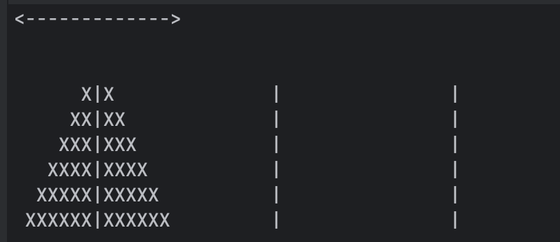

# hanoi-game

## How to build
```bash
mkdir build
cmake -B build -S ./ 
cmake --build build --config Release --target all 
```

## How to run
 ./hanoi-game [number of disks]

 Type "q" to quit

## How to play
Use arrows to change selector. Use space to select or release disk

